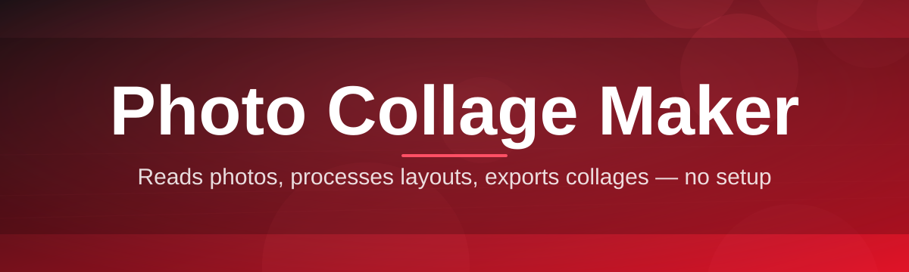
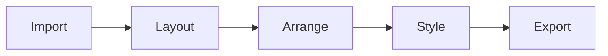

# photo-collage-maker-editor 🖼️✂️

  

*Turn a folder of loose photos into a gallery-worthy collage in the time it takes to brew a coffee.*

  

---

## 📌 Overview

**photo-collage-maker-editor** is a desktop-grade photo collage maker built for people who want polished results without wrestling with layers, plugins, or subscription paywalls. Under the hood it treats a collage as a living grid — drag a photo in, and the grid reflows, rebalances spacing, and keeps every frame aligned to a shared visual rhythm. It's the kind of tool you reach for when you need a wedding album spread, a travel-recap poster, a moodboard for a design pitch, or just a birthday card collage assembled from a messy phone gallery.

The project exists because most "free" collage tools online are either watermark traps, browser tabs that choke on more than a dozen images, or apps so bloated with filters and stickers that the actual *collage-making* gets buried. This editor strips that away: import your photos, pick a layout, arrange, export. No account creation, no cloud upload, no telemetry-hungry installer. Everything runs locally on your machine.

It's aimed at hobbyist photographers, social media creators batching carousel posts, small business owners building product mosaics, students assembling scrapbook-style projects, and anyone who has ever opened five different apps trying to merge photos into one clean canvas. Whether you're building a 2x2 grid or a 12-photo mosaic wall, this tool scales with your ambition.

## 📋 Requirements at a Glance

| Requirement | Minimum | Recommended |
|---|---|---|
| OS | Windows 10 (64-bit) | Windows 11 |
| RAM | 4 GB | 8 GB+ |
| Storage | 300 MB free | 1 GB free (for exports/cache) |
| Display | 1280x720 | 1920x1080 or higher |
| Dependencies | None — standalone | None — standalone |
| Internet | Not required after download | Optional, for update checks |

> [!NOTE]
> This is a standalone Windows build. No .NET redistributables, no Python runtime, no browser engine to install separately — it just runs.

---

## 🧩 Up and Running

Getting a collage from "empty canvas" to "exported masterpiece" takes four steps:

1. **Visit the landing page** — click the download button below or at the bottom of this README.

2. **Grab the latest build** — the page always serves the current stable release, no version-hunting required.

3. **Launch the executable** — no installer wizard to click through, no admin prompt gauntlet.

4. **Drop in your photos** — drag and drop a folder or select files individually, choose a grid, and start arranging.

> [!TIP]
> Keep your source photos in one folder before importing — the app's file picker supports multi-select, and batch-importing is noticeably faster than adding images one at a time.

---

## 🎨 What It Actually Does

- **Adaptive Grid Engine** — layouts aren't rigid templates; the grid recalculates cell ratios as you add, remove, or resize photos, so nothing ever looks cramped or lopsided.

- **Freeform Canvas Mode** — for people who hate grids, a freeform mode lets you scatter, rotate, and layer photos like a physical scrapbook table.

- **Smart Crop Assist** — auto-detects the busiest region of a photo (faces, high-contrast areas) so cropping into a tile doesn't accidentally chop off someone's head.

- **Border & Spacing Controls** — fine-tune gutter width, corner radius, and background fill down to the pixel, with live preview as you drag sliders.

- **Text & Sticker Overlays** — captions, dates, and simple sticker shapes can be layered directly onto the collage canvas without needing a separate editor.

- **Multi-Format Export** — output to PNG, JPEG, or PDF, with resolution presets tuned for social media, print, and desktop wallpaper.

- **Undo-Everything History** — a deep undo/redo stack means experimenting with layouts never feels risky.

- **Project Save Files** — save a collage-in-progress as a project file and reopen it later without re-importing every photo.

- **Theme-Aware Interface** — light and dark UI themes that don't fight with your photos for visual attention.

<strong>📐 Available layout categories (click to expand)</strong>

 

| Category | Example Grids | Best For |
|---|---|---|
| Classic Grid | 2x2, 3x3, 4x4 | Instagram squares, quick mosaics |
| Panorama Strip | 1x5, 1x8 | Travel recaps, timelines |
| Mosaic Mix | Mixed cell sizes | Highlight photos with varying importance |
| Polaroid Stack | Freeform overlap | Scrapbook, nostalgic aesthetics |
| Poster Wall | Large + small tiles | Event recaps, family walls |

---

## ⚙️ How It Works

The editor follows a simple, predictable pipeline from import to export:

1. **Import** — photos are read and thumbnailed without modifying the originals.

2. **Layout Selection** — you choose a grid or freeform template as the collage skeleton.

3. **Arrangement** — drag, resize, crop, and reorder tiles; the engine keeps spacing consistent.

4. **Styling** — apply borders, background color, text, and theme touches.

5. **Export** — render the final composite at your chosen resolution and format.

> [!IMPORTANT]
> Original photo files are never overwritten — the editor only reads them and writes new composite files on export. Your source library stays untouched.

---

## 🛟 Troubleshooting

**Q: My photos look blurry in the exported collage — what happened?**
A: Check your export resolution preset. If a low-res social preset is selected while using large source photos, downscaling can look softer than expected. Switch to a higher preset before exporting.

**Q: The app won't launch after downloading.**
A: Windows SmartScreen sometimes flags new executables it hasn't seen before. Click "More info" then "Run anyway" — this is standard for independently distributed apps that aren't yet widely rated by Microsoft.

**Q: Can I recover a collage I closed without saving?**
A: Only if you saved a project file beforehand. Unsaved sessions aren't auto-recovered in the current build — saving early and often is recommended.

**Q: Smart Crop keeps cutting off part of a group photo.**
A: Smart Crop optimizes for the busiest single region, which can misjudge scenes with multiple faces spread wide. Switch that tile to manual crop mode for full control.

**Q: My exported PDF pages look pixelated when printed.**
A: PDF export uses your on-screen preview resolution by default. Bump the export DPI setting to at least 300 before printing physical copies.

**Q: Does this collage maker upload my photos anywhere?**
A: No. All processing happens locally on your machine — there is no cloud sync or background upload involved.

---

## ⌨️ Interface, Shortcuts & Settings

  

| Shortcut | Action |
|---|---|
| `Ctrl + N` | New collage project |
| `Ctrl + O` | Open saved project |
| `Ctrl + S` | Save project |
| `Ctrl + Shift + E` | Export current collage |
| `Ctrl + Z` / `Ctrl + Y` | Undo / Redo |
| `Delete` | Remove selected tile |
| `Ctrl + D` | Duplicate selected tile |
| `Ctrl + G` | Toggle grid snapping |
| `Space + Drag` | Pan canvas |
| `+` / `-` | Zoom in / out |

> [!TIP]
> Hold `Shift` while resizing a tile to preserve its original aspect ratio — great for keeping portraits from stretching sideways.

Settings worth knowing about:

- **Autosave interval** — configurable from 1 to 15 minutes.

- **Snap sensitivity** — adjusts how aggressively tiles snap to grid lines and to each other.

- **Default export folder** — set once so you're never hunting through File Explorer.

- **Theme accent color** — light/dark base with a customizable accent used across sliders and highlights.

---

## 🤝 Contributing & Community

This project genuinely welcomes new contributors — collage layouts, crop algorithms, and UI polish all have room to grow, and there's no gatekeeping around experience level.

> [!TIP]
> Look for issues tagged `good first issue` — they're scoped intentionally small so first-time contributors can land a meaningful change without needing to understand the whole codebase.

- **Report bugs** with steps to reproduce, your Windows version, and (if possible) a sample photo set that triggers the issue.

- **Suggest layouts** — if you have a grid idea that isn't covered, open a discussion with a rough sketch.

- **Improve docs** — clarifying a confusing paragraph is just as valuable as shipping code.

- **Review pull requests** — a second pair of eyes on someone else's PR moves the whole project forward.

> [!NOTE]
> Please be kind in issue threads and PR reviews. This community runs on patience, especially toward newcomers still learning the codebase.

---

## 📄 License

Released under the [MIT License](LICENSE), 2026. Use it, remix it, ship it inside your own projects — just keep the license notice intact.

---

## ⚠️ Disclaimer

This software is provided "as is," without warranty of any kind. The maintainers are not liable for lost files, corrupted exports, or collages so beautiful they cause spontaneous nostalgia. Always keep backups of your original photos before batch editing — that's just good digital hygiene, collage tool or not.

